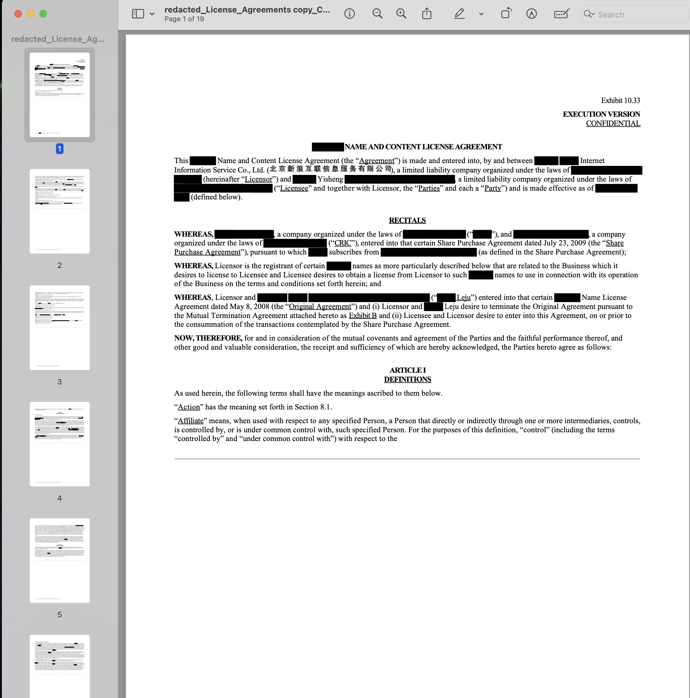
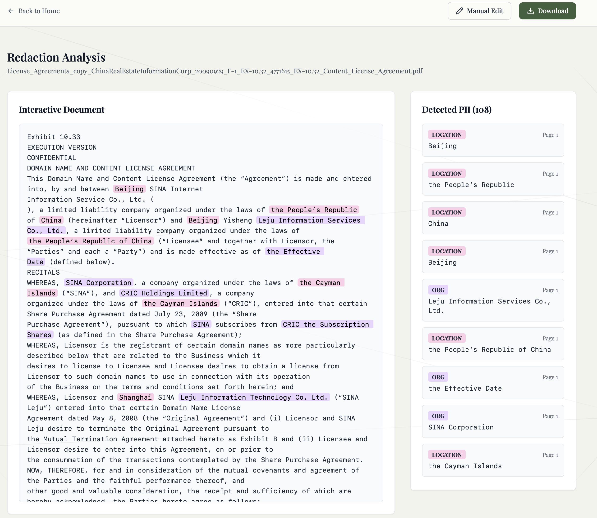

# Local PDF Redaction Tool

Self-serve redaction for contracts and general PDFs. Drop a file in the browser, let the backend flag high-risk text, review highlights, then download a scrubbed copy. Everything runs on your machine—no third-party AI services.

## Why it exists

- **Rapid PII cleanup** for names, emails, phone numbers, and locations in legal docs.
- **Manual override** so you can click any word and choose “redact once” or “redact all occurrences” before export.
- **Local-first workflow** designed for teams who cannot ship sensitive material to cloud APIs.

> **Heads up:** This app reuses pieces of an older contract-extraction prototype. The UI and backend still contain legacy naming (`ContractData`, sample contract lists, etc.). The redaction flow is stable, but expect some leftover terminology until we finish the refactor.

## Screenshots





## Feature tour

- **Upload experience** – Single PDF upload or batch queue with progress indicators and sample contracts for demoing.
- **Automated PII detection** – `spaCy` + regex heuristics scan every page, returning offsets, page numbers, and entity types.
- **Interactive dashboard** – Detected text appears highlighted in `Dashboard.tsx`. Hover to reject false positives or approve bulk removals via the context popover.
- **Manual edit mode** – Switch to “Manual Edit,” click or drag to select text in the document preview, and choose between single or bulk add redactions.
- **Undo safety net** – Recent removals surface an undo toast so you can revert accidental changes.
- **One-click export** – `generate_redacted_pdf` builds a new file with blacked-out regions matching your final redaction list.

## Architecture

- **Frontend** (`src/`)
  - `App.tsx` toggles between the landing hero and the dashboard once redaction jobs finish.
  - `UploadModal.tsx` handles single/batch uploads, sample templates, and progress UI.
  - `Dashboard.tsx` renders the document viewer, manual edit tools, action popovers, and download button.
- **Backend** (`backend/app.py`)
  - Accepts PDF uploads, extracts text with `PyMuPDF`, and runs entity detection via `spaCy` (`en_core_web_sm`) plus regex for emails/phones.
  - Returns `full_text`, redaction coordinates, and page offsets so the frontend can mirror positions.
  - Generates a redacted PDF by searching for text spans and applying black rectangles.

## Getting started

```bash
# Clone the repository
git clone <your-repo-url>
cd <your-repo-directory>

# Spin up the local stack
docker-compose up --build
```

Frontend: http://localhost:5173  
Backend API: http://localhost:5000

If you prefer running without Docker:

```bash
# frontend
cd frontend
npm install
npm run dev

# backend (Python 3.10+)
cd backend
pip install -r requirements.txt
python app.py
```

## Current focus

- PII-centric automation (PERSON, ORG, LOCATION, EMAIL, PHONE)
- Manual annotation for edge cases the model misses
- Fast local iteration for legal teams experimenting with redaction workflows

## Roadmap & cleanup notes

- Normalize naming (replace remaining “contract analysis” references).
- Trim unused extractor-specific UI and sample data sets.
- Expand entity coverage (financial data, IDs) and improve bulk editing tools.
- Package backend model downloads and spaCy cache setup for first-time installs.

## Contributing

Contributions are welcome—especially around refactoring legacy terminology, improving entity detection, and tightening the manual editing UX. Open an issue or submit a PR with context on the problem you’re solving.
